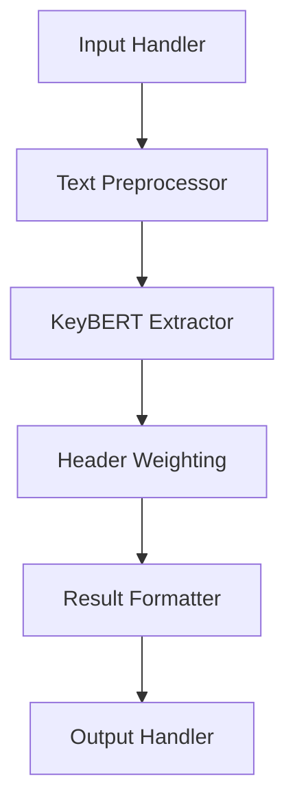

# Design Document: Keyword and Theme Extraction (KTE) Module

## Overview

The Keyword and Theme Extraction (KTE) module is designed to analyze book content and extract the most relevant keywords and themes that capture the essence of the text. This module will serve as a critical component in the book cover development pipeline, providing essential input for downstream tasks such as image selection, title generation, and color scheme determination.

The KTE module will implement a focused approach using KeyBERT, a state-of-the-art keyword extraction technique that leverages BERT's semantic understanding capabilities. The module will prioritize multi-word phrases and give special weight to content found in headers, as these typically encapsulate the most important thematic information.

The module will be implemented as both a CLI tool and a Python module, with the ability to process input from either Markdown (.md) files or PDF (.pdf) files. Output will be displayed in the console by default, with an option to save results to a file. The architecture will be modular to allow for future integration of additional keyword extraction methods beyond KeyBERT.

## Architecture

The KTE module will follow a clean, modular architecture with clear separation of concerns:



### Key Components

1. **Input Handler**: Accepts and validates text input, detecting format and presence of structural elements.
2. **Text Preprocessor**: Normalizes text, identifies and tags structural elements like headers if not already tagged.
3. **KeyBERT Extractor**: Core component that applies the KeyBERT algorithm to extract keywords and phrases with relevance scores.
4. **Header Weighting**: Adjusts relevance scores based on the presence of terms in header sections.
5. **Result Formatter**: Organizes extracted keywords, ranks them, and prepares the structured output.
6. **Output Handler**: Delivers the final result in the specified format (JSON).

## Components and Interfaces

### Input Handler

```python
def handle_input(input_source: str, options: dict = None) -> dict:
    """
    Process and validate the input from file or text content.

    Args:
        input_source: Path to a .md or .pdf file, or raw text content
        options: Optional configuration parameters

    Returns:
        dict: Processed text with metadata

    Raises:
        ValueError: If input is empty or invalid
        FileNotFoundError: If specified file doesn't exist
        UnsupportedFileTypeError: If file type is not supported (.md or .pdf)
    """
```

### Text Preprocessor

```python
def preprocess_text(input_data: dict) -> dict:
    """
    Normalize text and identify structural elements.

    Args:
        input_data: Dict containing text and metadata from input handler

    Returns:
        dict: Preprocessed text with identified structural elements
    """
```

### KeyBERT Extractor

```python
def extract_keywords(preprocessed_data: dict, options: dict = None) -> dict:
    """
    Extract keywords and phrases using KeyBERT.

    Args:
        preprocessed_data: Dict containing preprocessed text
        options: Optional configuration for KeyBERT

    Returns:
        dict: Extracted keywords with relevance scores
    """
```

### Header Weighting

```python
def apply_header_weighting(extraction_results: dict, preprocessed_data: dict) -> dict:
    """
    Adjust relevance scores based on presence in headers.

    Args:
        extraction_results: Dict containing extracted keywords
        preprocessed_data: Dict containing preprocessed text with header information

    Returns:
        dict: Keywords with adjusted relevance scores
    """
```

### Result Formatter

```python
def format_results(weighted_results: dict, options: dict = None) -> dict:
    """
    Format and rank the extraction results.

    Args:
        weighted_results: Dict containing keywords with adjusted scores
        options: Optional formatting configuration

    Returns:
        dict: Formatted and ranked keywords
    """
```

### Output Handler

```python
def prepare_output(formatted_results: dict, output_file: str = None) -> dict:
    """
    Prepare the final output in the required format and optionally save to file.

    Args:
        formatted_results: Dict containing formatted extraction results
        output_file: Optional path to save results (will not overwrite existing files)

    Returns:
        dict: Final output in standardized JSON format

    Raises:
        FileExistsError: If output file already exists
        PermissionError: If unable to write to specified location
    """
```

### Main API Function

```python
def extract_keywords(input_source: str, options: dict = None, output_file: str = None) -> dict:
    """
    Main API function for keyword extraction.

    Args:
        input_source: Path to a .md or .pdf file, or raw text content
        options: Optional configuration parameters
        output_file: Optional path to save results (will not overwrite existing files)

    Returns:
        dict: Extracted keywords in standardized format

    Raises:
        ValueError: If input is empty or invalid
        FileNotFoundError: If specified input file doesn't exist
        UnsupportedFileTypeError: If file type is not supported (.md or .pdf)
        KeyBERTError: If extraction process fails
        FileExistsError: If output file already exists
    """
```

## Data Models

### Input Options Schema

```python
InputOptions = {
    "max_keywords": int,  # Maximum number of keywords to return
    "min_relevance": float,  # Minimum relevance score threshold
    "header_weight_factor": float,  # Factor to increase relevance for header terms
    "prefer_phrases": bool,  # Whether to prioritize multi-word phrases
    "language": str  # Language of the input text
}
```

### Output Schema

```python
OutputSchema = {
    "keywords": [
        {
            "phrase": str,  # The extracted keyword or phrase
            "relevance_score": float,  # Relevance score (0.0 to 1.0)
            "is_phrase": bool,  # Whether it's a multi-word phrase
            "from_header": bool  # Whether it was found in a header
        }
    ],
    "extraction_method": str,  # Method used (KeyBERT)
    "timestamp": str,  # ISO format timestamp
    "metadata": {
        "processing_time": float,  # Time taken in seconds
        "input_length": int,  # Length of input text
        "options_used": dict  # Options used for extraction
    }
}
```

## Error Handling

The KTE module will implement comprehensive error handling to ensure robustness:

1. **Input Validation Errors**: Raised when input text is empty, too short, or in an unsupported format.
2. **Processing Errors**: Raised when the KeyBERT algorithm encounters issues during extraction.
3. **Resource Errors**: Raised when system resources are insufficient for processing large texts.
4. **Configuration Errors**: Raised when provided options are invalid or incompatible.

Each error will include:
- Error code
- Descriptive message
- Suggested resolution
- Context information for debugging

## Testing Strategy

The KTE module will be tested at multiple levels:

### Unit Tests

- Test each component function independently
- Verify correct behavior with various input types
- Test edge cases (empty text, very short text, very long text)
- Test error handling paths

### Integration Tests

- Test the complete extraction pipeline
- Verify correct interaction between components
- Test with realistic book content samples

### Performance Tests

- Benchmark processing time for various text sizes
- Test memory usage for large inputs
- Verify scalability with concurrent requests

### Validation Tests

- Compare extraction results with human-annotated keywords
- Measure precision and recall against a test corpus
- Evaluate the quality of multi-word phrases

## Implementation Considerations

### Dependencies

- **KeyBERT**: Core dependency for keyword extraction
- **Sentence-Transformers**: Required by KeyBERT for embedding generation
- **NLTK or SpaCy**: For text preprocessing and tokenization
- **PyPDF2 or pdfminer.six**: For extracting text from PDF files
- **Markdown**: For parsing Markdown files

### Performance Optimization

1. **Chunking Strategy**: For very large texts, implement a chunking strategy to process sections independently and then aggregate results.
2. **Caching**: Implement caching of intermediate results to avoid redundant processing.
3. **Batch Processing**: Process multiple documents in batch mode when possible.
4. **Model Optimization**: Use optimized versions of BERT models (e.g., DistilBERT) for faster processing.

### Extensibility

While the initial implementation will focus solely on KeyBERT, the architecture is designed to allow future extensions:

1. **Extraction Strategy Interface**: Define a common interface that all extraction methods must implement.
2. **Plugin Architecture**: Allow additional extraction methods to be registered as plugins.
3. **Ensemble Support**: Design data structures to support future ensemble approaches combining multiple extraction methods.

## Deployment Considerations

The KTE module will be packaged as a standalone Python package with clear documentation and examples. It will be designed to work both as:

1. An imported library within larger applications
2. A standalone service with a REST API (future extension)

Resource requirements will be documented, particularly the memory needs for the BERT models used by KeyBERT.

### Hugging Face Integration

The module uses Hugging Face Hub for model downloads. To ensure reliable operation:

1. **API Token Support**: The module supports `HF_TOKEN` environment variable for authenticated access
2. **Rate Limiting**: Anonymous users may encounter rate limits; API tokens provide higher limits
3. **Caching**: Models are cached locally to reduce download frequency
4. **Offline Mode**: Once cached, models can be used offline

**Configuration Options**:
- `HF_TOKEN`: Hugging Face API token for authenticated access
- `HF_HOME`: Cache directory for downloaded models
- `HF_HUB_DISABLE_TELEMETRY`: Disable telemetry to reduce API calls
- `HF_HUB_OFFLINE`: Enable offline mode when models are cached

**Getting Started**:
1. For basic usage: No configuration required (anonymous access)
2. For production usage: Set `HF_TOKEN` environment variable
3. For offline usage: Download models once, then use offline mode
